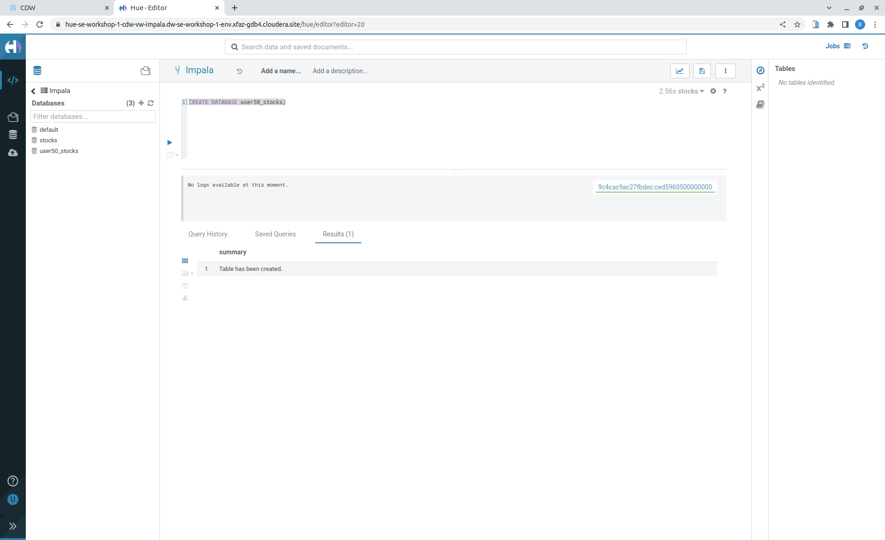
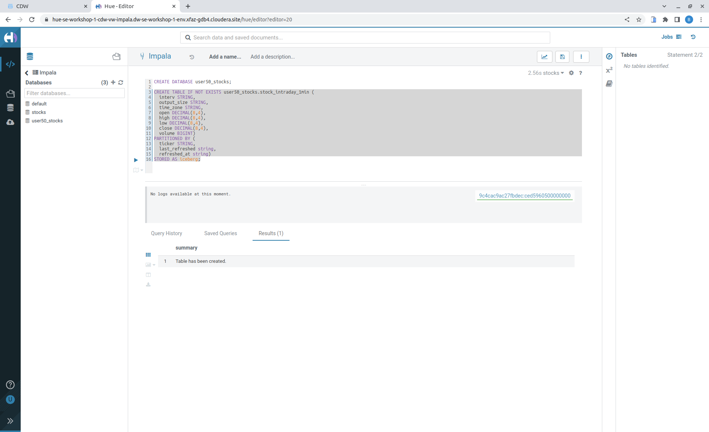
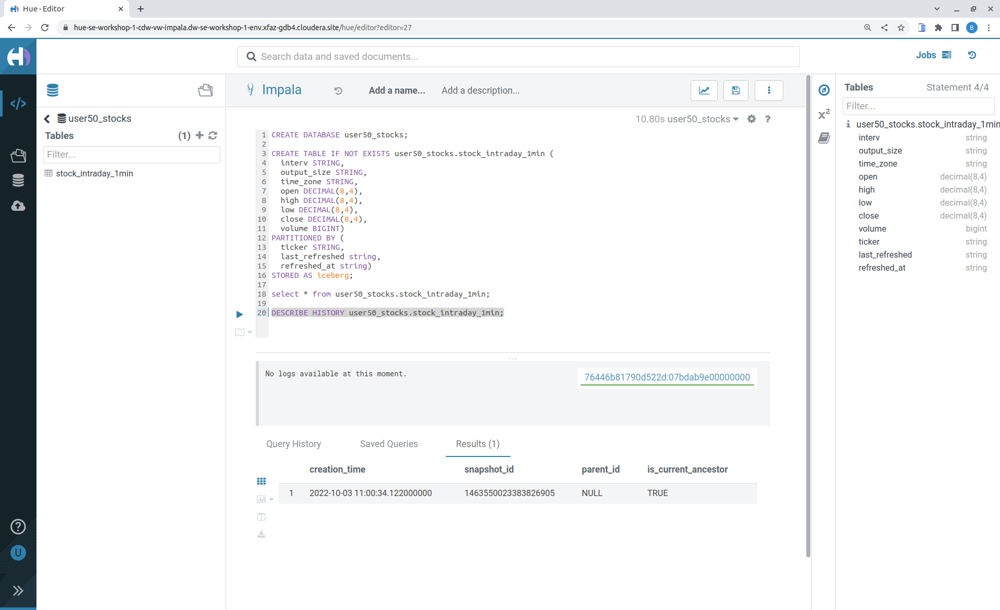
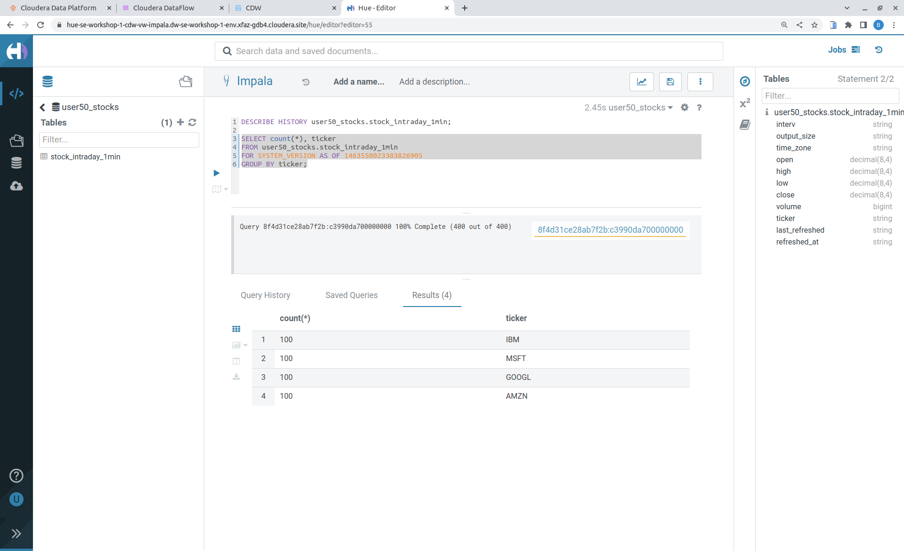
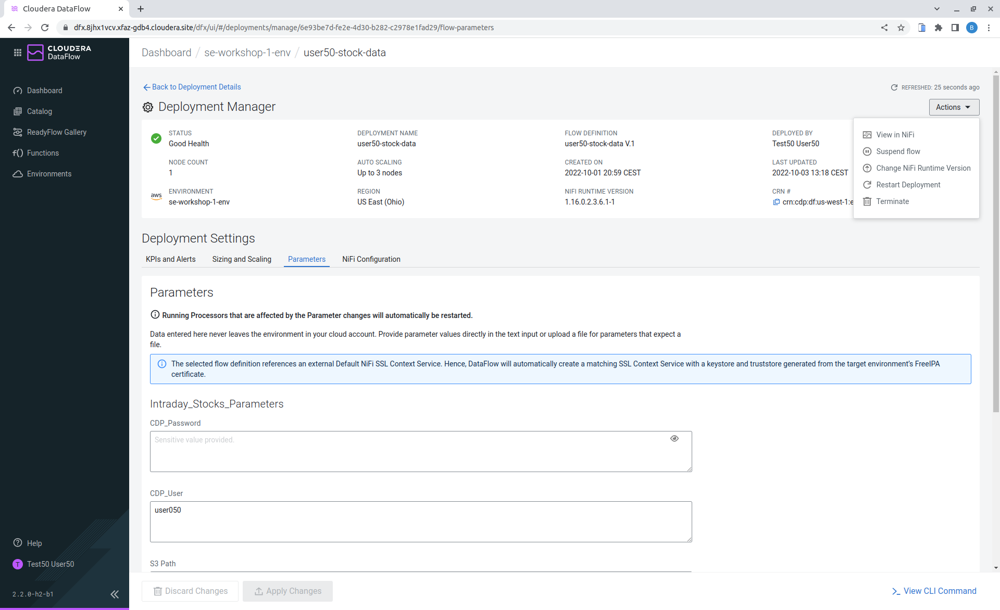
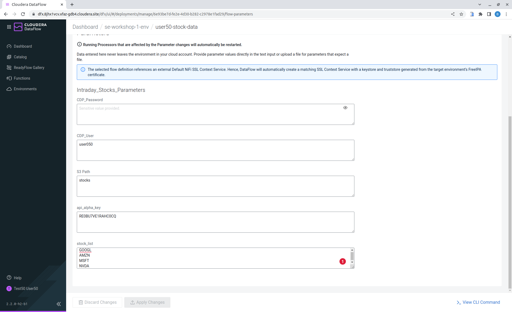
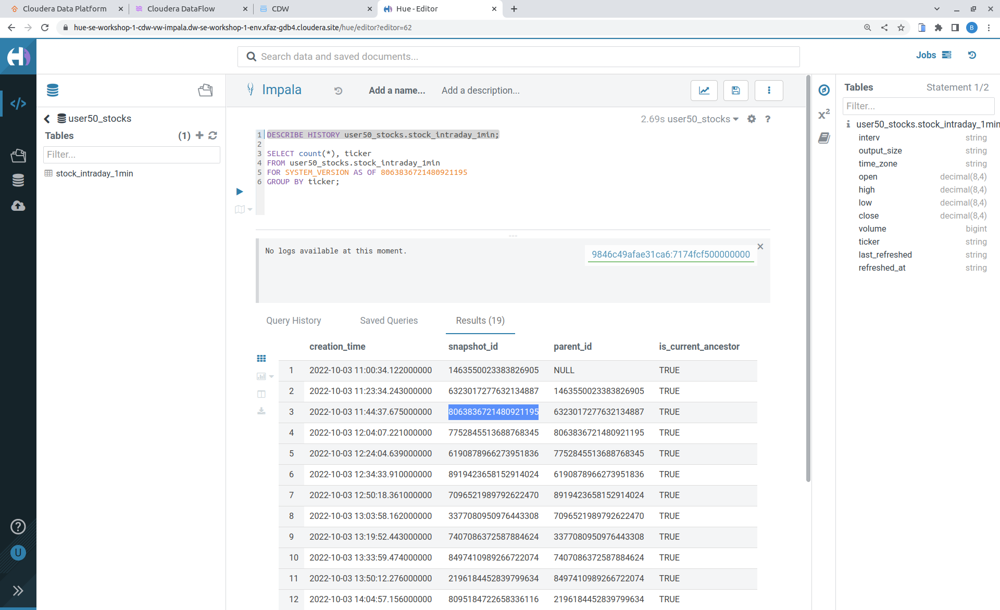
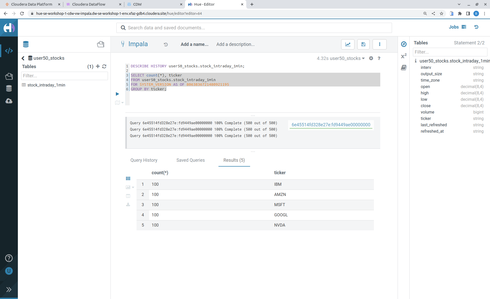
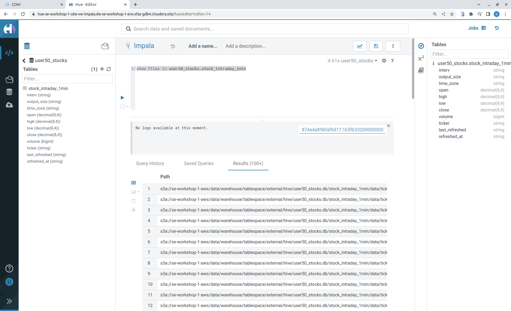

# Partner Summit 2022 - Workshop Student Guide


This document guides students through the Hands on lab for Partner Summit 2022. It will take you step by step to completing the Prerequisites and deliver this demo.

---

## Introduction

The purpose of this repository is to enable the easy and quick setup of the Partner Summit workshop. Cloudera Data Platform (CDP) has been built from the ground up to support hybrid, multi-cloud data management in support of a Data Fabric architecture. This worshop provide an introduction to CDP, with a focus on the data management capabilities that enable the Data Fabric and Data Lakehouse.

## Overview

In this exercise, we will work get stock data from [Alpha Vantage](https://www.alphavantage.co/), offers free stock APIs in JSON and CSV formats for realtime and historical stock market data,

- Data ingestion and streaming—provided by ***Cloudera Data Flow (CDF)*** and
***Cloudera Data Engineering (CDE)**.
- Global data access, data processing and persistence—provided by ***Cloudera Data Hub (CDH)***.
- Data visualization with ***CDP Data Visualization***.

***Cloudera DataFlow (CDF)*** is a scalable, real-time streaming analytics platform that ingests, curates, and analyzes data for key insights and immediate actionable intelligence. CDF’s Flow Management is powered by Apache NiFi, a no-code data ingestion and management solution. Apache NiFi is a very mature open source solution meant for large scale, high velocity enterprise data ingestion use cases.

***Cloudera Data Engineering (CDE)*** is a serverless service for Cloudera Data Platform that allows you to submit batch jobs to auto-scaling virtual clusters. CDE enables you to spend more time on your applications, and less time on infrastructure. CDE allows you to create, manage, and schedule Apache Spark jobs without the overhead of creating and maintaining Spark clusters. With Cloudera Data Engineering, you define virtual clusters with a range of CPU and memory resources, and the cluster scales up and down as needed to run your Spark workloads, helping to control your cloud costs.

***CDP Data Visualization*** enables data engineers, business analysts, and data scientists to quickly and easily explore data, collaborate, and share insights across the data lifecycle—from data ingest to data insights and beyond. Delivered natively as part of Cloudera Data Platform (CDP), Data Visualization delivers a consistent and easy to use data visualization experience with intuitive and accessible drag-and-drop dashboards and custom application creation.


## Pre-requisites

1. Laptop with a supported OS (Windows 7 not supported) or Macbook.
2. A modern browser - Google Chrome (IE, Firefox, Safari not supported).
3. Wifi Internet connection.
4. Git installed.

## Step 1: Get github project


<br>
You can use the workshop project cloning this github repository :

[Workshop login](https://github.com/bguedes/partner-summit-2022)

```console
git clone https://github.com/bguedes/partner-summit-2022t
```

## Step 2: Get Alpha Vantage Key

Go to website [Alpha Vantage](https://www.alphavantage.co/)<br>
Choose link -> 'Get Your Free Api Key Today'
</br>


Choose 'Student' for description<br>
Choose your own organisation<br>
Fill up your professional email address<br>
</br>


Choose 'Student' for description<br>
Choose your own organisation<br>
Fill up your professional email address<br>
Request your key
</br>


</br>

Store your given key, you will need it later.
</br>

## Step 3: Access CDP Public Cloud Portal

Please use the login url [Workshop login](https://login.cdpworkshops.cloudera.com/auth/realms/se-workshop-1/protocol/saml/clients/cdp-sso)


Enter the username and password shared by your instructor.


You should be able to get the following home page of CDP Public Cloud.


## Step 4: Define Workload Password

You will need to define your workload password that will be used to parameters the Data Services.<br>
Please keep it with you, if you have forget it, don't panic, you will be able to repeat this process and define another one.<br>
</br>
Click on your profile.


</br>


</br>

Define your password.
</br>
Click button -> "Set Workload Password".
</br>


<br>


Check that you have this mention -> "Workload password is currently set".
</br>

## Step 5: Create the flow to ingest stock data via API to Object Storage

### CDP Portal

<br>


Choose CDF icon.<br>

### Create a new CDF Catalog


[Stocks_Intraday_Alpha_Template.json](Stocks_Intraday_Alpha_Template.json)


### Deploy DataFlow


###  View Nifi DataFlow


### Create Iceberg Table

Create database using your login user050, for example replace <user> by user050 for database creation :


```sql

CREATE DATABASE <user>_stocks;

```
See the result



After create a Iceberg table, change <user> with your login :

```sql

CREATE TABLE IF NOT EXISTS <user>_stocks.stock_intraday_1min (
  interv STRING,
  output_size STRING,
  time_zone STRING,
  open DECIMAL(8,4),
  high DECIMAL(8,4),
  low DECIMAL(8,4),
  close DECIMAL(8,4),
  volume BIGINT)
PARTITIONED BY (
  ticker STRING,
  last_refreshed string,
  refreshed_at string)
STORED AS iceberg;

```

See the result




## Step 6: Process and Ingest Iceberg using CDE

## Step 7: Create Dashboard using CDP DataViz

## Step 8: Query Iceberg Tables in Hue and Cloudera Data Visualization

### Iceberg Architecture

Apache Icebeg is an open table format, originally designed at Netflix in order to overcome the challenges faced when using already existing data lake formats like Apache Hive.

The design structure of Apache Iceberg is different from Apache Hive, where the metadata layer and data layer are managed and maintained on object storage like Hadoop, s3, etc.

It uses a file structure (metadata and manifest files) that is managed in the metadata layer. Each commit at any timeline is stored as an event on the data layer when data is added. The metadata layer manages the snapshot list. Additionally, it supports integration with multiple query engines,

Any update or delete to the data layer, creates a new snapshot in the metadata layer from the previous latest snapshot and parallelly chains up the snapshot, enabling faster query processing as the query provided by users pulls data at the file level rather than at the partition level.

</br>


### Iceberg snapshots

Let's see the Iceberg table history

```sql

DESCRIBE HISTORY <user>_stocks.stock_intraday_1min;

```
</br>



</br>

Copy and paste the snapshot_id and use it on the following impala querie :

```sql

SELECT count(*), ticker
FROM <user>_stocks.stock_intraday_1min
FOR SYSTEM_VERSION AS OF <snapshot_id>
GROUP BY ticker;

```
</br>



</br>

#### Add new stock

Go to CDF, choose Actions and Suspend the flow.
Add in parameters called <stock_list> the stock NVDA (Nvidia)

</br>



</br>
</br>



</br>

Start again the flow.

#### Check new snapshot history

Now let check again the snapshot history :

</br>




</br>

As CDF has ingested a new stock value and then cde has merge those value it has created new Iceberg snapshots
Copy and paste the new snapshot_id and use it on the following impala query :

```sql

SELECT count(*), ticker
FROM <user>_stocks.stock_intraday_1min
FOR SYSTEM_VERSION AS OF <new_snapshot_id>
GROUP BY ticker;

```
</br>



</br>

Now, we can see that this snapshot retreive the count value for stock NVDA that has been added in the cdf dataflow stock_list parameter.

If we run this query without snapshot, we get all values, because all parents and child snapshots :

```sql

SELECT count(*), ticker
FROM <user>_stocks.stock_intraday_1min
GROUP BY ticker;

```
</br>


### Show Data Files

```sql

show files in <user50>_stocks.stock_intraday_1min

```

</br>



</br>
